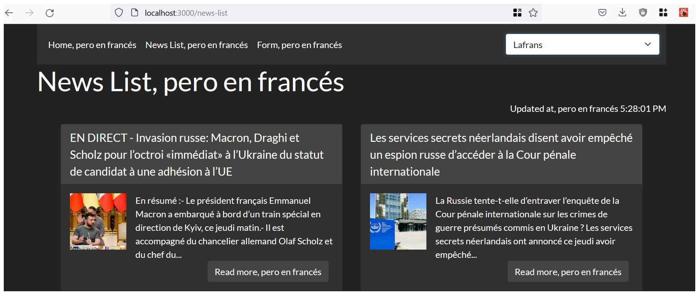

# React - Miniproject

Exercise for [The Bridge](https://thebridge.tech).

## Exercise requirements
* A React mini-project to practice all basic React elements already seen.
* Implement a "News Web"
* Use the [NYT News API](https://developer.nytimes.com/apis).
* Use React Router
* Use nested components (header, home, footer, form, news list).
* Use React Context
* Use SASS

## Development

### API
The NYT News API has some problems with credentials. We have used the
[Bing News API](https://www.microsoft.com/en-us/bing/apis/bing-news-search-api),
accessed through [rapidapi](https://rapidapi.com).

### Page structure
Every route builds a page with three components: Header and Footer are common to
all of them. The Header has three buttons, with `<Link />`, to access to the
three routes, and a Country selector with three options: USA, Spain, France.

### Routes
**Home** `/`
* A block of five headlines, as clickable items in an "item list".
* A side bar with add-like images.
* A big image, just to fill the space.

**News List** `/news-list`
* A flex-wrap block with 10 news-cards. With headline, short description, small
side image and a "Read more" button with the link.

**Form** `/form`
* A form to write news, with 4 inputs: headline, description, url and image-url.
* Data written by the user is saved in localStorage.

### Bootstrap
All the page is stylized with the "Darkly" [Bootstrap](https://getbootstrap.com/)
variant from [Bootswatch](https://bootswatch.com/).
The minified css file has been included in the `public/styles` folder and linked
from the index.html file.

It's **responsive** by default thanks to the `container` class and the `flex`
classes from BS. The big image in the Home will be hidden in smaller devices.

### SASS
To get a more granular style in the card-news, there is a `.scss` file to adjust
the maximum width of the card and the minimum width of the image in every card.
Some SASS functionalities have been tested in this file: variables, mixins and
extend.

### Use Context
React Context Variables have been implemented to keep track of: articles loaded,
last time when the news have been fetched from the API, and selected country.

To avoid too many requests to the API, news in the same language are not fetched
again until 60 seconds have passed. Changing the language, instead, triggers
againt the function to get the articles.

### Author

Xavimat: [GitHub](@xavi-mat) | [LinkedIn](https://www.linkedin.com/in/xavier-matoses/)
